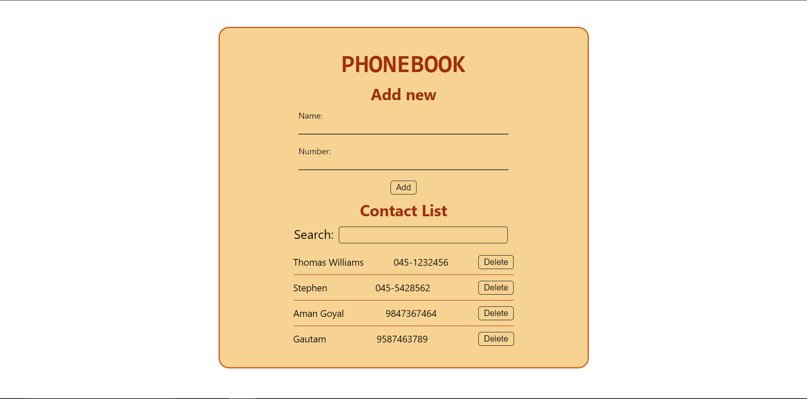

# Phonebook

A web application to save, search, update, and delete phone numbers of people.

- Frontend: ReactJS
- Backend: Express.js + node.js
- Database: MongoDB atlas

### Video Demo

> https://youtu.be/t8F6pJdrsNk

### Live

> https://phonebook-mern-production.up.railway.app/

### Features

- Add name and phone numbers
- Name validations

  - Unique
  - Length >= 3
  - Required

- Number validations
  - Should contain all digits
  - If hyphen(-) exists, number of digits before hyphen should be 2 or 3
  - Length >= 8
  - Required
- Search via name
- Update phone number of a contact
- Delete contact

### Run on your local machine

1. Clone this repository, and install dependencies.

```bash
$ git clone https://github.com/py-piyush/phonebook-mern.git
$ cd phonebook-mern/backend
$ npm install
```

2. Create a cluster in MongoDB Atlas and connect your application by providing `MongoDB_URI` as a environment varialbe(MONGODB_URI).
3. Create .`.env` file in same directory as package.json, then add following line. Replace dummy value with your MongoDB_URI

```bash
MONGODB_URI = "mongodb+srv://*****"
```

4. Run application, and go to http://localhost:3001

```bash
$ npm start
```

### Demo Pictures


